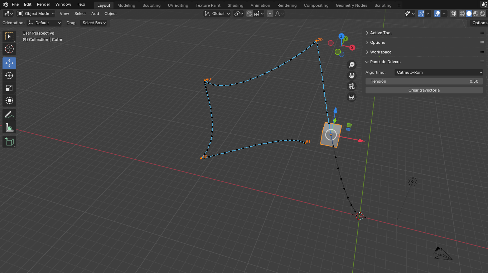
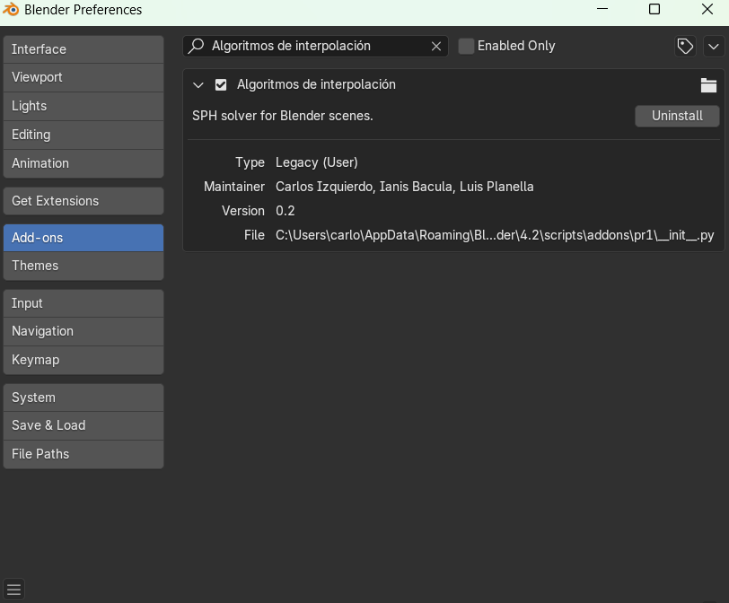

# Fase 1 del proyecto

### Autores

- Carlos Izquierdo 
- Luis Planella
- Ianis Bacula

# Creación de los difernetes métodos de interpolación

Este repositorio contiene el código fuente para la creación de un addon en Blender diseñado para poder hacer uso de los tres
diferentes tipo de interpolación (lineal, Hermite y Catmull-Rom).
El script propociona la funcinalidad para poder elegir uno de los tres algoritmos e interpolar con los fotogramas claves intertados.



### Estructura del proyecto

<pre>
.
└── src/
    └── interpola.py
    └── posiciion.py
</pre>

### Descripción de los scripts

- `interpola.py`: Contiene funciones de interpolación lineal, Hermite y Catmull-Rom utilizadas
- `posicion.py`: Contiene la función que calcula la interpolación en cada frame, además de el script que implementa la interzas de usuario.

### Descripción detallada

El script `posicion.py` es el script principal de nuestro addon. Permite controlar la animación de objetos usando tres métodos de interpolación: lineal, Hermite, y Catmull-Rom. Añade propiedades de interpolación y velocidad/tensión al objeto, las cuales se configuran mediante un panel en la interfaz. 
Al invocar el operador, se asignan drivers a las coordenadas de posición del objeto, utilizando el método de interpolación seleccionado para calcular su movimiento en base a los fotogramas clave de la animación.

El script `interpola.py` contiene las funciones de interpolación lineal, Hermite y Catmull-Rom. Estas funciones se utilizan para calcular la posición de un objeto en un momento específico de la animación, basado en los fotogramas clave y las propiedades de interpolación.

#### Funciones de interpolación:

````python
def lineal(t: float, t0: float, t1: float, x0: float, x1: float):
    """
    Algoritmo de interpolación lineal

    Parameters
    ----------
    t : float
        tiempo entre t0 y t1 en el que queremos la posición
    t0 : float
        inicio del tramo
    t1 : float
        fin del tramo
    x0 : float
        posicion al inicio del tramo
    x1 : float
        posición al final del tramo

    Returns
    -------
    float
        El valor interpolado en el tiempo t.

    """
    u = (t - t0) / (t1 - t0) # Proporción de tiempo transcurrido
    x = x0 + u * (x1 - x0)
    return x
````

````python
def hermite(t: float, t0: float, t1: float, x0: float, x1: float, v0: float, v1: float):
    """
    Algoritmo de interpolación Hermite

    Parameters
    ----------
    t : float
        tiempo entre t0 y t1 en el que queremos la posición
    t0 : float
        inicio del tramo
    t1 : float
        fin del tramo
    x0 : float
        posición al inicio del tramo
    x1 : float
        posición al final del tramo
    v0 : float
        velocidad al inicio del tramo
    v1 : float
        velocidad al final del tramo
    Returns
    -------
    float
        El valor interpolado en el tiempo t.

    """
    u = (t - t0) / (t1 - t0) # Proporción de tiempo transcurrido

    # Coeficientes de Hermite
    h00 = 2 * u**3 - 3 * u**2 + 1
    h10 = u**3 - 2 * u**2 + u
    h01 = -2 * u**3 + 3 * u**2
    h11 = u**3 - u**2

    # Interpolación Hermite
    x = x0 * h00 + x1 * h01 + v0 * h10 + v1 * h11

    return x
````
````python 
def catmull_rom(t: float, t0: float, t1: float, tau: float, x0: float, x1: float, x2: float, x3: float):
    """
    Algoritmo de interpolación Catmull-Rom

    Parameters
    ----------
    t : float
        tiempo entre t0 y t1 en el que queremos la posición
    t0 : float
        inicio del tramo
    t1 : float
        fin del tramo
    tau : float
        tensión de la curva
    x0 : float
        posición al inicio del tramo
    x1 : float
        posición al final del tramo anterior
    x2 : float
        posición al inicio del tramo siguiente
    x3 : float
        posición al final del tramo

    Returns
    -------
    float
        El valor interpolado en el tiempo t.

    """
    v1 = tau * (x3 - x1) 
    v0 = tau * (x2 - x0)

    x = hermite(t, t0, t1, x1, x2, v1, v0)

    return x
````
### Creación del addon

1. Tomamos el archivo `posicion.py` y lo renombramos como `__init__.py`
2. Añadimos las siguientes líneas

    ````python
    from . import interpola

    bl_info = {
    "name": "Algoritmos de interpolación",
    "description" : "SPH solver for Blender scenes",
    "author" : "Carlos Izquierdo, Ianis Bacula, Luis Planella",
    "version" : (0, 2),
    "blender" : (2, 90, 0),
    "category" : "Object",
    }
    ````

    ````python
    if __name__ == "pr1":
    from . import interpola

    from importlib import reload
    reload(interpola)
    ````
3. Comprimimos el addon con una estructura de archivo como la siguiente:
   
   <pre>
   pr1.zip
   └──pr1/
        ├── __init__.py
        └── interpola.py
   </pre>

4. Importamos el addon en Blender, seleccionamos el zip y lo habilitamos
   `Edit > Preferences > Add-ons > Install`

   

### Enlace a los vídeos

1. Instalación del addon y ejecución de los diferentes algoritmos
   `https://youtu.be/buhx82ygYvw`

2. Prueba de interpolación con un circuito.
   `https://youtu.be/x1fBIf69uSI`
