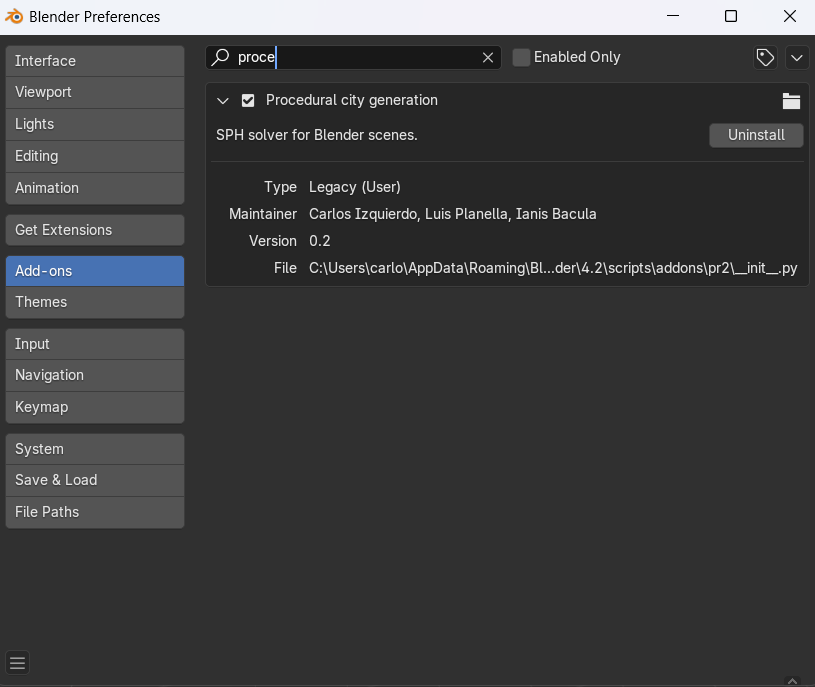

# Fase 2 del proyecto

### Autores

- Carlos Izquierdo 
- Luis Planella
- Ianis Bacula

# Creación de una ciudad procedural

La Fase 2 del proyecto presenta el código fuente para la creación de un addon en Blender diseñado para crear escenas con una ciudad procedural. El script proporciona la funcionalidad para crear edificios y vehiculos configurados de acuerdo a los parámetros seleccionados por el usuario.


### Estructura del proyecto

<pre>
.
└── src/
    └── Ciudad/
        └── city.py
        └── delete_objects.py
        └── GeneraGrid.py
        └── interpola.py
        └── posicion.py
        └── user_interface.py
        └── vehicles.py
</pre>

### Descripción de los scripts

- `city.py`: Contiene las funciones y la lógica para generar la ciudad
- `delete_objects.py`: Contiene la función para eliminar los objetos de la escena
- `GenerarGrid.py`: Contiene las funciones necesarias para poder generar el suelo para la ciudad
- `interpola.py`: Contiene funciones de interpolación lineal, Hermite y Catmull-Rom utilizadas en la animación de los vehículos.
- `posicion.py`: Contiene la función que calcula la interpolación en cada frame además de calcular la rotación y la asignación de los drivers para las coordinadas correspondientes.
- `user_interface.py`: Contiene la interfaz del usuario para que pueda poner las caracterísiticas de la ciudad que él quiera.
- `vehicles.py`: Contiene las funciones necesarias para poder crear el coche

### Descripción detallada

#### Parte 1: Interfaz gráfica

El scripit `user_interface.py` define un panel de control llamado "Procedural City" en Blender para crear ciudades procedurales con calles, edificios y coches animados. Permite configurar propiedades como el número de calles, tamaño de las manzanas, altura y varianza de los edificios, velocidad, cantidad y trayectorias de los coches, así como métodos de interpolación (lineal, Hermite y Catmull-Rom), oscilaciones y rotaciones. Incluye operadores para generar la ciudad eliminando objetos previos, crear coches animados y borrar los existentes. También define propiedades personalizadas de la escena para ajustar dimensiones, interpolación y rotación, además de permitir cargar archivos OBJ externos. Finalmente, implementa funciones para registrar y desregistrar clases y propiedades, asegurando la integración total del panel en Blender.

#### Parte 2: Ciudad

El script `city.py` es el script que implementa las funciones relacionadas con la generación de los edificios de nuestra ciudad procedural. Contiene funciones para crear un edificio y crear la ciudad.

**Ajustes disponibles al usuario:**
  - Número de calles en ambos ejes
  - Tamaño de los edificios (manzanas)
  - Anchura de las calles
  - Altura de los edificios
  - Variabilidad de los edificios

#### Parte 3: Vehiculos e interpolacion

El script `vehicles.py` es el script que implementa las funciones relacionadas con la generación de los vehiculos de nuestra ciudad procedural. Contiene funciones para crear varios vehiculos.

**Ajustes disponibles al usuario**
  - Número de los vehículos que se desea añadir a la escena.
  - Velocidad de los vehículos (en calles por segundo). 
  - Número de giros que realizarán los vehículos

Cabe destacar que la posición (calle y altura) de los vehículos será aleatoria

El script `interpola.py` contiene las funciones de interpolación lineal, Hermite y Catmull-Rom. Estas funciones se utilizan para calcular la posición de un objeto en un momento específico de la animación, basado en los fotogramas clave y las propiedades de interpolación.

El script `posicion.py` implementa funciones para calcular la interpolación de posición de los objetos en cada fotograma utilizando métodos como lineal, Hermite y Catmull-Rom. Además, calcula la rotación de los objetos basándose en su trayectoria, ajustando los cuaterniones de orientación según el eje de alineación, el eje lateral y un posible alabeo adicional. También incluye herramientas para asignar automáticamente drivers que controlan las coordenadas de posición y rotación de los objetos animados.

#### Parte 4: Generación de Terreneo (en esta práctica no se genera)

El script `GenerarGrid.py` genera el suelo de una ciudad en Blender creando una malla de 100x100 con subdivisiones y ajustando la altura de los vértices según una función matemática basada en sus coordenadas. También elimina previamente cualquier malla existente para garantizar que el nuevo suelo se cree desde cero.

#### Parte 5: Eliminación de los objetos

El scrpit `delete_objects.py` elimina todos los objetos de la ciudad en Blender seleccionando aquellos cuyo nombre comienza con "Building", "Grid", "CocheAnimado_" o "Sphere" y luego eliminándolos de la escena.

### Creación del addon

1. Tomamos el archivo `user_interface.py` y lo renombramos como `__init__.py`
2. Añadimos las siguientes líneas

    ````python
  from . import delete_objects
  from . import city
  from . import vehicles
  from . import interpola


    bl_info = {
  "name": "Procedural city generation",
  "description" : "SPH solver for Blender scenes",
  "author" : "Carlos Izquierdo, Luis Planella, Ianis Bacula",
  "version" : (0, 2),
  "blender" : (2, 90, 0),
  "category" : "Object",
  }
    ````

    ````python
  if __name__ == "pr2":
    from . import delete_objects
    from . import city
    from . import vehicles
    from . import interpola


  from importlib import reload
  reload(delete_objects)
  reload(city)
  reload(vehicles)
  reload(interpola)
    ````
3. Comprimimos el addon con una estructura de archivo como la siguiente:
   
   <pre>
   ciudad.zip
   └──ciudad/
        ├── __init__.py
        └── city.py
        ├── delete_objects.py
        ├── interpola.py
        └── vehicles.py
   </pre>

4. Importamos el addon en Blender, seleccionamos el zip y lo habilitamos
   `Edit > Preferences > Add-ons > Install`

   

### Enlace a los vídeos

https://youtu.be/lDGUN_CUl0Y