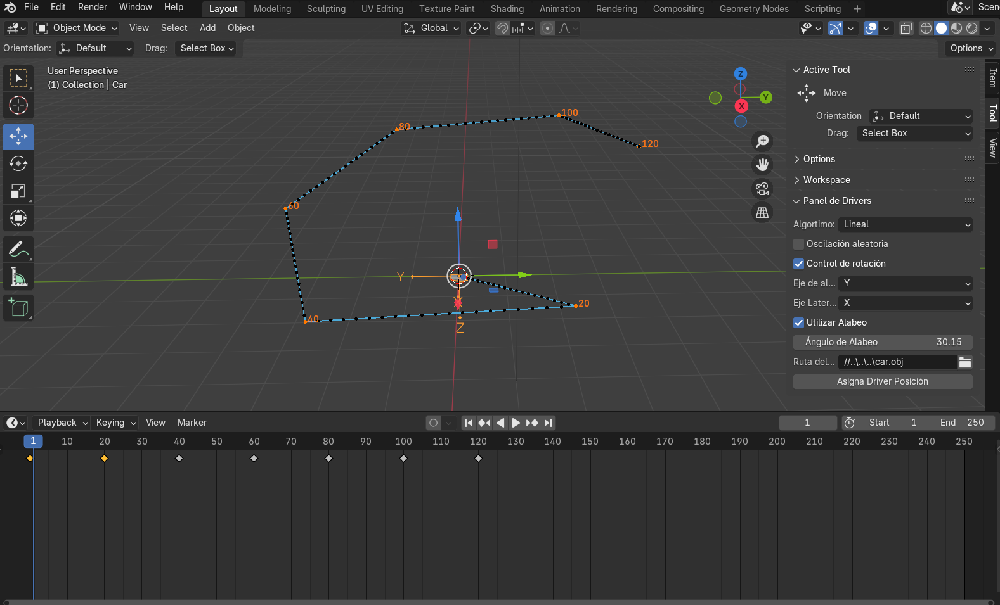
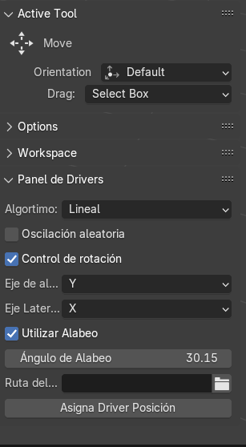

# Fase 3 del proyecto

### Autores

- Carlos Izquierdo 
- Luis Planella
- Ianis Bacula

# Creación de los difernetes métodos de interpolación

La Fase 3 del proyecto presenta una expansión de la funcionalidad de la herramienta respecto a la [Fase 1](Leeme_Practica1.md).
Los cambios incluyen la introducción de un explorador de archivos para importar un objeto vehiculo y las rotaciones de dicho vehiculo
para alinear la trayectoria de nuestro objeto vehículo a la tangente de las curvas.



### Estructura del proyecto

<pre>
.
└── src/
    └──Interpolacion/
        └── interpola.py
        └── posiciion.py
</pre>

### Caracterísitcas añadidas:

### Interfaz gráfica

En la interfaz se han realizado varias mejoras enfocadas en personalizar y optimizar el control del vehículo.
- Checkbox para activar y desactivar la rotación: Esta opción permite al usuario controlar si el coche realiza movimientos de rotación. Desactivar la rotación puede ser útil para pruebas específicas o para vehículos que solo se mueven en líneas rectas o trayectorias fijas.
- Propiedad del eje de alineación del coche: Se ha añadido una propiedad ajustable que permite alinear el coche respecto a un eje específico.Esto es útil para definir cómo se posiciona el vehículo en el espacio tridimensional.
- Propiedad del eje lateral del coche: Esta propiedad controla la orientación lateral del coche, permitiendo ajustes en la dirección en la que  "mira" o se mueve lateralmente
- Checkbox para activar y desactivar el alabeo
 


### Funcion que define y llama a los drivers

Esta función crea un driver para una coordenada de rotación específica en el objeto dado y asigna una expresión personalizada que será evaluada en función del valor de las variables correspondientes.

```python
def asigna_driver_rotacion(obj,coord):
    # Creamos el driver en la coordenada elegida. El driver se queda
    # guardado en la variable drv
    drv = obj.driver_add('rotation_quaternion',coord).driver
    # Habilitamos la posibilidad de que reciba el propio objeto, que
    # necesitaremos para acceder a los fotogramas clave.
    drv.use_self = True
    # Asignamos la expresión que queremos que se utilice.
    # Se está utilizando una "f-string" para constuir una cadena
    # a partir del valor de las variables coord y method
    drv.expression = f"get_quaternion(frame, self, {coord})"
```
Dentro de la función execute del operador que controla la interfaz, se comprueba el estado del checkbox de control de rotación (control_rotacion). Si está activado, el objeto cambia automáticamente su modo de rotación a cuaternión ('QUATERNION') y se asignan drivers a las cuatro componentes del cuaternión (w, x, y, z) mediante la función asigna_driver_rotacion. Esto asegura que la orientación del objeto se ajuste automáticamente en función de la trayectoria o lógica configurada.

```python
if obj.control_rotacion == True:
            obj.rotation_mode = 'QUATERNION'
            for i in range(4):
                asigna_driver_rotacion(obj, i)
```

### Funcion get_quaternion

Se ha implementado la función get_quaternion para calcular dinámicamente el cuaternión de rotación necesario para alinear un objeto (como un vehículo) con su trayectoria en un fotograma específico. Esto permite una transición fluida entre las orientaciones del objeto a lo largo de su movimiento, manteniendo su alineación con la dirección deseada y ajustándose a las configuraciones de rotación adicionales.

```python
def get_quaternion(frm: float, obj, coord: int):
    """
    Calcula el cuaternión de rotación del objeto en el fotograma dado determinando
    un vector con las posiciones actual y anterior del objeto y otro vector con la
    dirección tangente
    Parámetros:
    - frame (float): El fotograma actual.
    - obj (Object): El objeto que sigue la trayectoria.
    - coord (int): La coordenada del cuaternión a calcular.
    
    Retorna:
    - float: El cuaternión de rotación del objeto en la coordenada especificada.
    """
    
    # Obtener la posición actual y anterior del objeto
    if frm == bpy.context.scene.frame_start:
        v1 = mathutils.Vector([get_posicion(frm+1, obj, 0), get_posicion(frm+1, obj, 1), get_posicion(frm+1, obj, 2)])
        v0 = mathutils.Vector([get_posicion(frm, obj, 0), get_posicion(frm, obj, 1), get_posicion(frm, obj, 2)])
    else:
        v1 = mathutils.Vector([get_posicion(frm, obj, 0), get_posicion(frm, obj, 1), get_posicion(frm, obj, 2)])
        v0 = mathutils.Vector([get_posicion(frm-1, obj, 0), get_posicion(frm-1, obj, 1), get_posicion(frm-1, obj, 2)])

    # Vector tangente a la trayectoria
    d = v1 - v0
    t = d.normalized()

    # Seleccionar el eje inicial del objeto basado en la propiedad 'alinear_eje'
    if obj.eje_alineacion == 'X':
        e1 = Vector((1, 0, 0))
    elif obj.eje_alineacion == 'Y':
        e1 = Vector((0, 1, 0))
    elif obj.eje_alineacion == 'Z':
        e1 = Vector((0, 0, 1))
    elif obj.eje_alineacion == '-X':
        e1 = Vector((-1, 0, 0))
    elif obj.eje_alineacion == '-Y':
        e1 = Vector((0, -1, 0))
    elif obj.eje_alineacion == '-Z':
        e1 = Vector((0, 0, -1))

    if obj.eje_lateral == 'X':
        e2 = Vector((1, 0, 0))
    elif obj.eje_lateral == 'Y':
        e2 = Vector((0, 1, 0))
    elif obj.eje_lateral == 'Z':
        e2 = Vector((0, 0, 1))
    elif obj.eje_lateral == '-X':
        e2 = Vector((-1, 0, 0))
    elif obj.eje_lateral == '-Y':
        e2 = Vector((0, -1, 0))
    elif obj.eje_lateral == '-Z':
        e2 = Vector((0, 0, -1))

    l = obtener_vec_lateral(t)
    up = t.cross(l)
    up.normalize()

    # Alinear con el tangente
    q1 = get_quat_from_vecs(e1, t)

    # Ajustar de la direcció vertical
    e3 = e1.cross(e2)
    e3prima = q1 @ e3

    q2 = get_quat_from_vecs(e3prima, -up)
    qFinal = q2 @ q1

    
    #Aplicacion de una rotacion adicional
    if obj.utilizar_alabeo == True:
        AngleAdicional = math.radians(obj.ang_alabeo)
        ang_def = AngleAdicional / 2
        sen = math.sin(ang_def)
        cos = math.cos(ang_def)
        q3 = mathutils.Quaternion((cos, sen*t.x, sen*t.y, sen*t.z))
        qFinal = q3 @ qFinal


    return qFinal[coord]

```
### Función get_quat_from_vecs

La función get_quat_from_vecs se utiliza para calcular el cuaternión que representa la rotación necesaria para alinear un vector de referencia con un vector objetivo. Esto es clave para ajustar la orientación del objeto a lo largo de una trayectoria o en cualquier otra transformación espacial.

``` Python 

def get_quat_from_vecs(e, t):
    """
    Calcula el cuaternión que representa la rotación entre dos vectores.
    
    Parámetros:
    e (Vector): Eje de alineacion del objeto.
    t (Vector): Vector tangente del objeto.
    
    Retorna:
    Quaternion: El cuaternión que representa la rotación entre los dos vectores.
    """
    e = Vector(e)
    t = Vector(t)

    v = e.cross(t)
    v.normalize()
    angle = math.acos(max(-1.0, min(1.0, e.dot(t))))

    angulo_def = angle / 2

    sen = math.sin(angulo_def)
    cos = math.cos(angulo_def)

    q = mathutils.Quaternion((cos, sen*v.x, sen*v.y, sen*v.z))

    return q

```
### Función obtener_vec_lateral

La función obtener_vec_lateral calcula el vector lateral de un objeto a partir de un vector tangente dado, que representa la dirección en la que el objeto se está desplazando.

``` Python

def obtener_vec_lateral(v):
    """
    Calcula el vector lateral del objeto determinando un vector con 
    la dirección tangente deseada.

    Parámetros:
    - v (Vector): Vector tangente del objeto.
    
    Retorna:
    - l (Vector): El vector lateral del objeto en el frame deseadp.
    """
    z = mathutils.Vector((0, 0, 1))

    l = z.cross(v)
    l.normalize()
    return l

```

### Metodos de interpolacion

El script 'interpola.py' no ha sufrido ninguna modificacion en esta tercera practica del proyecto.

### Enlace a los vídeos

1. Inserción de fotogramas claves y configuración de parámetros
https://youtu.be/x1IXI9Ee-Is

2. Video del circuito renderizado
3. https://youtu.be/Vq_t3LHJejE


