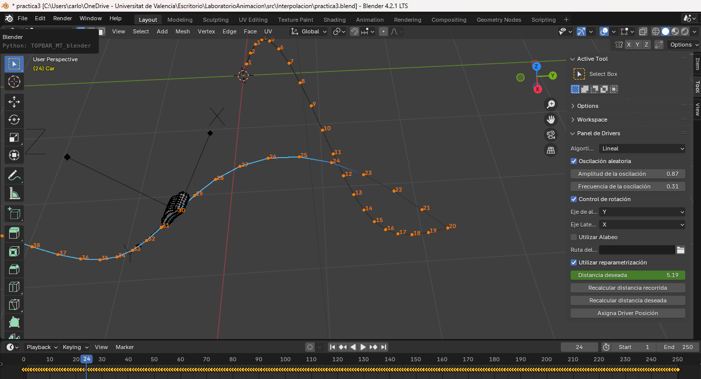
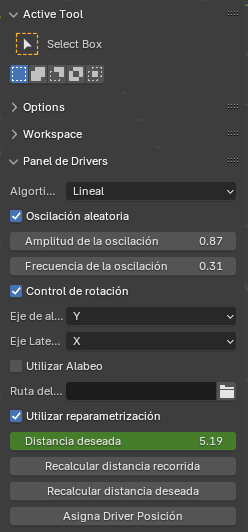

# Fase 4 del proyecto

### Autores

- Carlos Izquierdo 
- Luis Planella
- Ianis Bacula

### Control de la velocidad

La Fase 3 del proyecto presenta una expansión de la funcionalidad de la herramienta respecto a la [Fase 1](LEEME_Practica1.md) y la [Fase 3 ](LEEME_Practica3.md), centrada en la modificación de la velocidad en el recorrido de las trayectorias de los vehiculos. Los cambios incluyen la introducción de dos nuevas propiedades del Objeto para almacenar la distancia recorrida por el vehiculo originalmente y otra para almacenar la distancia que desea el usuario que el vehiculo haya recorrido en dicho fotograma. También se introduce una expansión en la interfaz de usuario introduciendo este control de velocidad, permitiendo su activación y desactivación, introducir la distancia deseada y botones para recalcular las curvas.



### Estructura del proyecto

<pre>
.
└── src/
    └──Interpolacion/
        └── interpola.py
        └── posiciion.py
</pre>

## Características añadidas

### Interfaz Gráfica
Añadidos a las propiedades de los vehículos:

- Checkbox para activar y desactivar la utilización de reparametrizaciñon
- Curva con la distancia recorrida (no visible para el usuario en el panel)
- Propiedad para realizar la curva con la distancia deseada.



### Ciudad Procedural

No han habido añadidos al script `city.py`

### Modificaciones en el movimiento de los vehículos

El siguiente código calcula la distancia total recorrida por un objeto a lo largo de su trayectoria en cada fotograma y registra estos valores como una propiedad animada llamada dist_recorrida. Para cada fotograma, se inserta un keyframe que representa la distancia acumulada desde el inicio.

```python
def longitud_recorrida(obj):
    distancia = 0
    obj.dist_recorrida = distancia
    obj.keyframe_insert(data_path="dist_recorrida", frame = 0)

    for i in range(1, bpy.context.scene.frame_end + 1):
        p = mathutils.Vector([get_posicion(i, obj, j) - get_posicion(i-1, obj, j) for j in range(3)])
        distancia += p.length
        obj.dist_recorrida = distancia
        obj.keyframe_insert(data_path="dist_recorrida", frame = i)
    
```

El siguiente código calcula el fotograma correspondiente a una distancia recorrida deseada por un objeto. Si la curva animada dist_recorrida no existe en las propiedades del objeto, debe ser creada previamente (por ejemplo, con una función como longitud_recorrida). La función busca los keyframes más cercanos a la distancia deseada y, si es necesario, interpola linealmente entre ellos para determinar el fotograma exacto. Si la distancia deseada supera la distancia máxima registrada, devuelve el último fotograma disponible.

```python
def frame_desde_longitud(obj):
    
    curva_recorrida = obj.animation_data.action.fcurves.find('dist_recorrida')
    distancia_deseada = obj.dist_deseada
    iterador = 0
    while (iterador < len(curva_recorrida.keyframe_points) and curva_recorrida.keyframe_points[iterador].co[1] < distancia_deseada):
        iterador += 1
            
    if iterador < len(curva_recorrida.keyframe_points):
        frm = interpola.lineal(distancia_deseada, curva_recorrida.keyframe_points[iterador-1].co[0], curva_recorrida.keyframe_points[iterador].co[0], curva_recorrida.keyframe_points[iterador-1].co[1], curva_recorrida.keyframe_points[iterador].co[1])
    else:
        frm = curva_recorrida.keyframe_points[-1].co[0]

    return frm
```

En cuanto a get_posicion, se ha añadido el código necesario para poder utilizar la funcion frame_desde_longitud(obj) y obtener el frame que deseamos.

```python
if obj.utilizar:
        if obj.animation_data and obj.animation_data.action:
            frm =  frame_desde_longitud(obj)
```

### Enlace a los vídeos
https://youtu.be/WIHCpCSgqdY